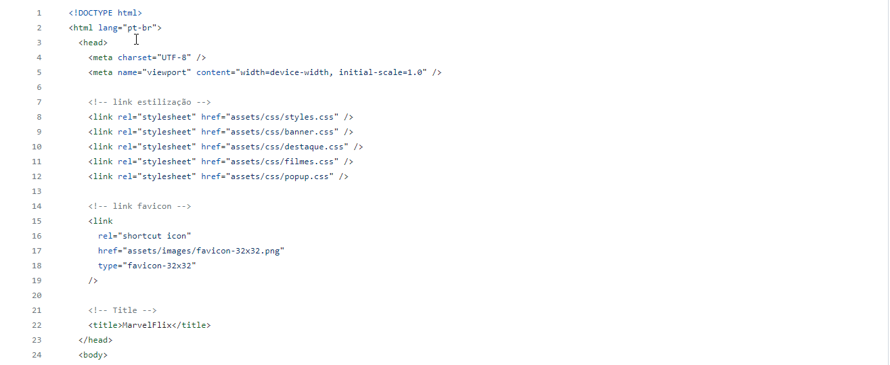
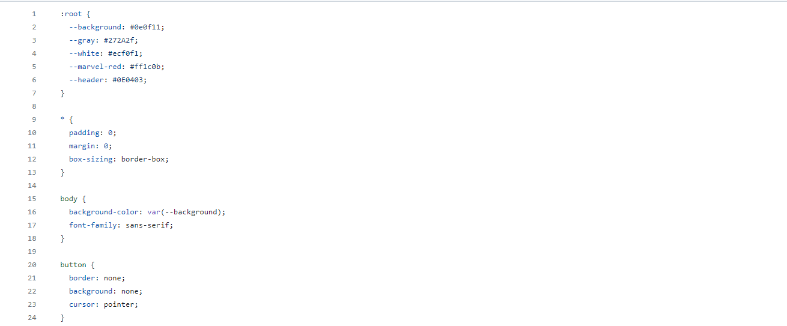
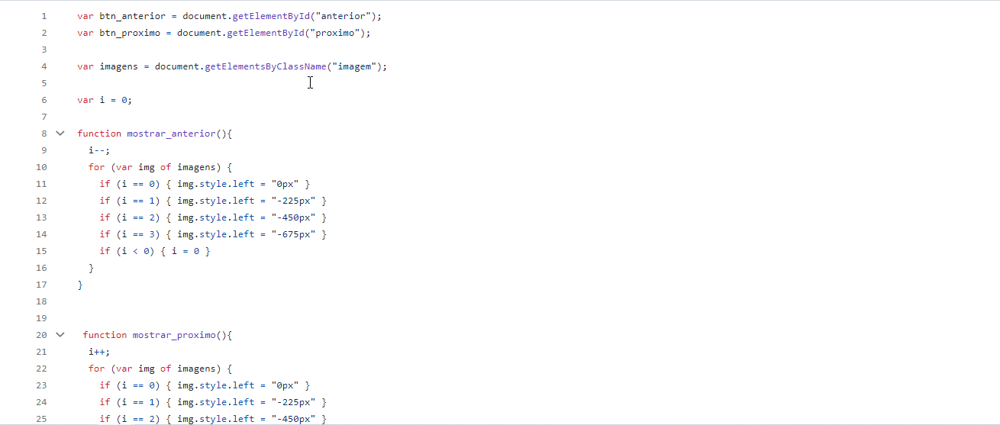
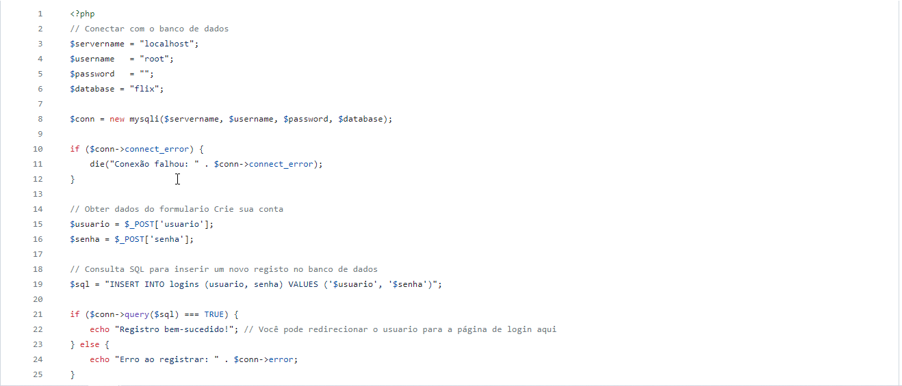

# Project_MarvelFlix

A simple website, showcasing some Marvel Studio movies and series

## Readme Contents:
- [Summary](#summary)
  - [About the project](#about)
  - [preview](#preview)
- [My code](#codes)
  - [HTML](#html)
  - [CSS](#css)
  - [Javascript](#js)
  - [PHP](#php)
- [Process](#process)
  - [Designed](#designed)
  - [Learned](#learned)
- [Autor](#autor)
  - [Credits](#credits)
  - [link](#link)
 
## summary

### about
  

Project developed by the author "Natália F. Dev," I borrowed a lot from her project to develop this one. However, I made some modifications to this project. The initial project was to create a simple website with a Marvel theme, but the modification I made was to add a login and registration option. It is still in the development phase, but the idea behind it was to create a login screen for users to access the project. Note: It's likely that there will be an update to implement this part in the future. 

### preview

## My code

### codes

### HTML

Code HTML

### CSS

Code CSS

### js

Code Javascript

### php

Code PHP

## process

### designed

 - semantic HTML;
- CSS priorities;
- Website;
- PHP Functions;
- Register and login;
- Javascript Functions.
 
### learned
  
🟢 Simples login and Register;  
🟢 WebSite.

## autor

### autor

  

### credits
  

### link

**Link to acess the project:**
https://patrickcaramico.github.io/Project_MarvelFlix/
  
